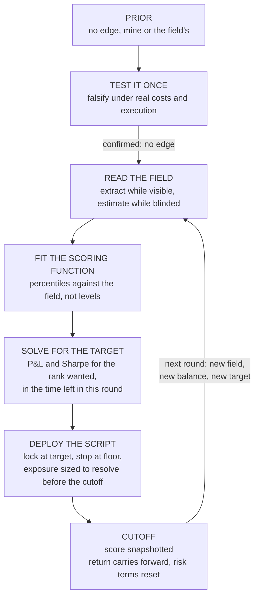

# Game-Theoretic Quant Strategies

This repo contains code samples for a game-theoretic approach to quantitative
algorithmic trading.

They are selected samples and assets extracted from a larger proprietary
codebase to demonstrate the approach.

The code and approach were used to reach a finalist position in a quantitative
trading hackathon when tested against a live trading simulation and hundreds of
competitors.

*This demo repo was compiled and written with the assistance of a coding agent
and as a result may include some AI phrasing.*

## Repo contents

| Folder | File | What it does |
|---|---|---|
| **`scoreboard-analysis/`** | `analyze_leaderboard.py` | fits an equation to the live scoreboard, mapping score against P&L and Sharpe percentile |
| | `quantify_tiers.py` | quantifies what P&L, at what Sharpe, reaches what rank |
| | `round3_leaderboard_benchmark.md` | the fitted scoring model and the P&L thresholds per tier |
| | `leaderboard_1830.csv`<br>`leaderboard_2130.csv` | anonymised leaderboard extracts, three hours apart |
| **`strategy-analysis/`** | `strategy_menu.md` | every category of play available, trading and metagame |
| | `score_strategies.py` | expected score per candidate, discounted by elimination risk |
| **`backtests/`** | `crypto_pressure_test.py` | naive leveraged directional trading test, measuring return spread and elimination risk per leverage |
| | `barrier_test.py` | lock-at-target rule test over a year of one-minute bars, measuring win, elimination and rank locked |
| | `barrier_score_test.py` | lock-at-target rule test scored on the full competition formula, including drawdown, Sharpe and risk discipline |
| | `robustness_test.py` | the adaptive ladder, the self-stop, the instrument choice |
| | `barrier_scan_gpu.py` | the same barrier count over a year of bars, running identical code on GPU or CPU |
| | `crypto_pressure_test_results.md` | measured results and conclusions from the directional and barrier exit tests |
| **`game-theory-and-agents/`** | `barrier_model.py` | models the stopping rule: win probability and time to resolve at each leverage and target, checked against simulation, then extended to the round deadline |
| | `target_rank_agent.py` | agent that loops over deterministic tools to report the rank a book currently reaches and the P&L and Sharpe needed to clear a target tier |

Some of what ran live is not here. The execution layer, the wider research suite
and the field-estimation work are described below but not published.

## Context

A two-week live algorithmic trading competition. Solo entry, simulated capital,
real market data and a realistic execution model.

- **Capital:** 1,000,000 USD simulated, maximum 30x leverage
- **Platform:** MetaTrader 5, driven from Python. Spread crossed on entry and
  exit, with depth, partial fills and slippage modelled
- **Instruments:** 15 in total. 8 FX pairs, 2 metals, 5 crypto, on a netting
  account, so no hedging the same symbol against itself
- **Format:** daily rounds, each scored on equity at the 22:00 cutoff. Top 100
  advanced to a two-day final
- **Elimination:** forced liquidation at 30% margin level ends your run outright
- **Visibility:** the leaderboard was public during the early rounds and blinded
  for the final
- **Scoring:** `70% Return Rank + 15% Drawdown Rank + 10% Sharpe Rank + 5% Risk
  Discipline`, every component a percentile against the field

The competition's own backtest data covered FX and metals only, so the five
crypto instruments had to be backtested on external data.

I entered at the second week, skipping the testing and strategising phase,
meaning the ability to test, deploy and trade in quick succession was key.

## Approach

Most quantitative work optimises several things at once, such as return, risk and
drawdown, all measured against the market. In this competition your position
depended only on how you compared with the other competitors, not on the market
itself. That changes what the best strategy is.

The approach was based on the idea that no competitors, as retail traders, would
have consistent market alpha within the simulation rules. If no one can beat the
market, no one's results are driven by skill. They are driven by **variance**,
and variance, unlike alpha, can be measured, sized and stopped.

**If nobody in the field has an edge, the winner is decided by who manages
variance against the scoring rule, not by who predicts the market.**

> **You cannot beat the market. You can forecast and beat the field.**

Four steps follow:

1. **Test whether an edge exists.** This decides whether you are playing a skill
   game or a variance game, and everything after it depends on the answer.
2. **Fit the scoring function to the field.** Even where the weights are
   published, what they are worth in practice depends on the distribution of
   everyone else, which is not.
3. **Solve for the P&L and Sharpe target.** Take the rank you want, read the
   score currently holding it, solve for the return percentile that produces
   that score, then read off the P&L sitting at that percentile in the field.
   The output is a concrete pair of numbers, a P&L and a Sharpe, for the time
   left in that round. Because rank saturates, that target is finite and usually
   far below "as much as possible".
4. **Deploy an algorithmic script to hit it, with a stopping rule.** Exposure
   sized so the position resolves inside the round, and a hard exit the moment
   the target is touched. This is what converts raw variance into a high
   probability of a specific outcome.

Step 1 runs once. Steps 2 to 4 ran again every round, because every input to
them moves: the field changes shape, the balance carried forward changes what is
at stake, and the drawdown and risk terms reset at each cutoff while return does
not. The target that was correct yesterday is not the target today.



The work splits across three components, each doing what it is reliable at.
**The human** frames the problem and makes the strategy calls, the parts with no
standard answer. **The LLM** generates code and turns messy input into structured
data, and is trusted with nothing else. **Deterministic code** owns the
backtests, risk rules and execution, which have to be exact and repeatable.

Where a number matters, code produces it. The model is never asked to estimate a
rank, only to process and translate.

---

# Worked example: a live trading competition

The sections below work through the approach in more detail, in the context of
the competition.

## 1. The game

| Element | This competition |
|---|---|
| **Players** | ~100 competitors, trading independently on the same instruments |
| **Action space** | instrument, direction, leverage $L$, entry time, and critically an **exit rule** |
| **State** | equity, drawdown, realised Sharpe, time remaining in the round $\tau$ |
| **Information** | full leaderboard in the early rounds, **blinded** in the final round |
| **Payoff** | percentile rank under the scoring formula, not P&L |
| **Premise** | no player has positive expected drift, so $\mu = 0$ for everyone |

The last two rows are what make it tractable. A zero-drift game with a
rank-based payoff has a solution that never requires predicting the market.

Those constraints are not neutral. Each one closes off a class of play:

| Constraint | Consequence |
|---|---|
| Leverage capped, penalties near the cap | the main lever, and the main way to die |
| Margin stop-out | **elimination, absorbing and unrecoverable** |
| Netting account | no same-symbol hedging, classic market-neutral pairs unavailable |
| Spread crossed on entry *and* exit | every round trip starts underwater |
| Fixed round cutoffs, score snapshotted | **a hard clock on every position** |
| Final round leaderboard hidden | the field must be predicted, not observed |

And the strategy classes available, before narrowing:

| Class | Verdict |
|---|---|
| Directional: trend, momentum, breakout, carry | no edge found |
| Mean-reversion: z-score fade, pairs, cross-asset RV | no edge found |
| Microstructure: spread capture, passive MM, scalping | blocked, no resting fills and spread paid both ways |
| Metric-targeted: drawdown, Sharpe, risk-discipline farming | too small a share of the score to win alone |
| **Rank and tournament plays** | **the only class that survived** |

**Code:** [`strategy_menu.md`](strategy-analysis/strategy_menu.md), [`score_strategies.py`](strategy-analysis/score_strategies.py)

## 2. Testing for edge

The prior was that retail alpha does not exist. It was tested rather than
assumed, under the competition's own spreads, costs and execution model:

* Transact at **real bid/ask**, never mid.
* **Chronological** train/test split, parameters chosen on train only.
* Significance bar raised above the textbook level to absorb multiple testing
  when sweeping large parameter grids.

Around a thousand signal and parameter combinations were tested across
order-flow imbalance, seasonality, cross-sectional momentum, trend and pair
mean-reversion. **Nothing cleared the bar out of sample.** Trend-following was
positive on train and flipped negative on test, the textbook overfit signature.

That result applies to the rest of the field as much as to me, and everything
after it follows from that.

**Code:** the research suite behind this is not published.

## 3. The scoring function is the loss function

$$\text{score} = 0.70\,R_{\text{ret}} + 0.15\,R_{\text{dd}} + 0.10\,R_{\text{sharpe}} + 0.05\,D_{\text{risk}}$$

Return is cumulative across the whole competition. The other three reset at
every round. Three consequences follow, and they define the objective:

1. **Return dominates**, at 70% against 30% combined.
2. **Only return is permanent.** Risk taken mid-round is forgiven at the
   snapshot, so intra-round risk is cheaper than it looks, except at the cutoff.
3. **Rank saturates.** Past the top decile, extra return buys almost no extra
   rank while the risk to obtain it keeps scaling. So there is a finite target
   that reaches any given rank, and exceeding it pays nothing.

### The target changed every round

Because of point 2, the target was recomputed at every cutoff rather than set
once. Three things moved between rounds and all of them fed back in: the shape of
the field, the balance carried forward, and the risk terms resetting to zero
while return did not. As each 22:00 cutoff approached, the question was not "how
much can I make" but "what is the cheapest position that clears the bar I need at
this specific snapshot, and can it resolve in the hours left".

Early rounds barely rewarded return at all. Most of the field was inactive or
negative, so finishing non-negative with a clean book was enough. At one Round 3
snapshot I sat at **rank 44 on $50 of profit**, with 21 players ranked below me
holding more P&L than I did:

| | P&L | Sharpe | Rank |
|---|---:|---:|---:|
| me | **$50** | 0.09 | **44** |
| | $38,419 | 0.00 | 50 |
| | $23,476 | 0.10 | 51 |
| | $11,138 | -0.02 | 46 |
| | $9,549 | -0.09 | 49 |

**$50 of profit outranked $38,419 of profit**, because the 30% of the formula
that is not return decided the order. 67 of 101 competitors were positive, and
the worst-ranked positive player sat at rank 67, so simply finishing a round
non-negative was worth comfortable qualification.

That inverts later. Once the field thins to people who are genuinely trading,
return rank starts separating again and the target rises, which is what the
barrier play in §5 was built for. The method does not change between those two
regimes. Read what the current field makes expensive, then buy the cheapest thing
that clears the bar before the snapshot.

**Code:** [`analyze_leaderboard.py`](scoreboard-analysis/analyze_leaderboard.py), [`leaderboard_1830.csv`](scoreboard-analysis/leaderboard_1830.csv)

## 4. Reading the field

Rank is meaningless without the field, so the field is a required input.

**While visible**, the leaderboard was published as a rendered table. A model
extracted it to structured data each round, with no numerical judgement handed to
it. Two anonymised snapshots are included, three hours apart.

### Who was actually a threat

The board publishes P&L, win rate and Sharpe for every competitor, which is
enough to separate anyone with something repeatable from anyone riding variance.

| | |
|---|---|
| Competitors | 101 |
| Median Sharpe | 0.020 |
| Sharpe ≥ 0.15 | 7 |
| Sharpe ≥ 0.30 | **1** |
| Correlation, P&L vs Sharpe | 0.31 |

The top of the board makes it plain. The biggest earner in the field made **8x
the P&L of the player in first place and still ranked below them**, on a Sharpe
of 0.17 against 0.88. The next seven by P&L all sit between 0.04 and 0.20. That
is the signature of large positions that happened to work, not of edge. If P&L
and consistency were both being driven by skill they would move together, and at
r = 0.31 they barely do.

**One competitor in 101 looked like they had something repeatable.** The premise
in §1 is not an assumption about the field, it is a measurement of it.

Caveats worth stating: Sharpe here is computed over a single round from 15-minute
equity samples, so one large move scores low by construction, and a single
snapshot is not proof across the whole competition. Low Sharpe shows no
*consistent* edge inside the window rather than no edge at all. Several accounts
were dormant, showing a trivial 100% win rate on no P&L.

A few competitors did appear to have found exploitable behaviour in the simulator
itself. I read that as against the rules and a disqualification risk, and did not
pursue it. That is what left game theory as the route.

**While hidden**, the final round published nothing. The field then had to be
estimated rather than read: most of it was moving randomly, so what mattered was
not tracking individuals but holding a view on how many were doing something
repeatable and how the variance-driven bulk would spread out by the cutoff.

**Fitting the objective to the field.** The leaderboard shows each player's P&L and Sharpe,
but not their drawdown rank or risk discipline. Only two of the four components
are observable, so only those two can be regressed on. The other two have nowhere
to go but the intercept. Run against the real snapshot:

```
score  =  19.99  +  0.690 x ReturnPct  +  0.085 x SharpePct        R2 = 0.83
```

`ReturnPct` and `SharpePct` are a player's percentile rank in the field, 0 to
100, not their P&L or Sharpe. `R2 = 0.83` means the fit accounts for 83% of the
variation in scores across the field.

The two fitted weights can be checked, because the competition published its
formula:

| Component | Fitted | Published |
|---|---:|---:|
| Return weight | 0.690 | 0.70 |
| Sharpe weight | 0.085 | 0.10 |

Both land close, so the method recovers a known answer rather than asserting one.

The intercept is the useful part. It is not a weight, it is where the two
unobservable components end up. Drawdown and risk discipline are worth `0.15` and
`0.05` of the score, so at full marks they contribute
`0.15(100) + 0.05(100) = 20`. The fit returns 19.99, which says almost the entire
field was running a clean book and neither term was separating anybody. That is
worth knowing before choosing what to optimise.

**Inverting it** produces the target. Read the fit backwards: a target rank $k$
has a score $s^\ast(k)$ on the board, which implies the return percentile needed to
reach it, which the field's own P&L distribution then prices:

$$k \longrightarrow s^\ast(k) \longrightarrow R^\ast_{\text{ret}} = \frac{s^\ast(k) - a - c\,R_{\text{sharpe}}}{b} \longrightarrow T$$

$T$ is the P&L sitting at that percentile, and the target the stopping rule locks
at. This was rerun at every cutoff, against that round's field and the time left
in it.

**Code:** [`analyze_leaderboard.py`](scoreboard-analysis/analyze_leaderboard.py), [`quantify_tiers.py`](scoreboard-analysis/quantify_tiers.py), [`round3_leaderboard_benchmark.md`](scoreboard-analysis/round3_leaderboard_benchmark.md), [`target_rank_agent.py`](game-theory-and-agents/target_rank_agent.py)

## 5. The play

Hold a leveraged **directional** position with **no expected edge**. Net neutral
in expectation, with real variance over the round. Lock the instant equity
touches $+T$, stop if it touches $-S$. At leverage $L$, equity is $E = 1 + Lr$,
so in **price** terms the barriers sit at $T/L$ and $S/L$.

Drawn to scale at 8x, with a +4% lock and a -40% stop:

```
equity
 1.04  |- - - - - - - - - LOCK  +4% - - - - - - - -    needs +0.5% price
       |             .-.    ..
 1.00  | ..   ....---' '----''---->   touch, flatten, bank the rank
       | ''---''
       |
       |
       |
       |
       |
       |
       |
       |
       |
 0.60  |- - - - - - - - - STOP  -40% - - - - - - - -    needs -5.0% price
```

The barriers are wildly asymmetric because leverage divides both of them by the
same factor. A +4% equity gain is only a +0.5% price move at 8x, while the stop
needs -5.0%, ten times further. Ordinary volatility touches the near barrier far
more often than the far one.

Under zero expected drift, first passage gives:

$$P(\text{lock before stop}) = \frac{S}{T+S} \qquad \mathbb{E}[\tau] = \frac{T S}{L^{2}\sigma^{2}}$$

Leverage cancels from the probability, since it scales both barriers identically.
It appears only in the time, as $1/L^2$.

**The clock is what makes leverage matter.** A round ends whether or not a
barrier has been touched, so there is a third outcome, unresolved, which lands on
a coin-flip terminal return. The real objective is:

$$P(\text{lock within } \tau) = P(\text{resolve within } \tau) \times \frac{S}{T+S}$$

Leverage does not improve the odds given resolution. It raises the chance of
resolving at all before the cutoff. Entering late with short windows is therefore
a leverage decision, not a reason to take directional risk.

Three design choices complete it:

**Direction is gated, never a thesis.** Trend-following tested dead, so the side
is picked by a selective strong-momentum gate and nothing is ever *held* on a
directional view. The gate barely outperforms picking a side at random. The
variance does the work, not the signal.

**A self-stop sits well inside the broker's liquidation level.** Forced
liquidation is absorbing and zeroes a cumulative return that never resets. A
self-stop converts that unrecoverable event into a survivable loss, removing
essentially all elimination risk for about a point of expected percentile.

**Leverage stays far below the cap.** Running at a fraction of the permitted
maximum keeps margin usage well under the penalty threshold and the margin level
far above the stop-out, so forced liquidation is not a realistic risk in the
first place. The self-stop triggers long before it.

Measured by `barrier_test.py` over a year of one-minute bars on rolling 48h
windows. Holding the
target fixed at +4% and changing only leverage:

| Config | P(lock) | P(elimination) | Reaches rank |
|---|---:|---:|---:|
| 5x, lock @ +4% | 82% | 0.25% | ~23 |
| **8x, lock @ +4%** | **89%** | **1.0%** | **~23** |

Same barriers, same target, same rank if it lands. 8x simply resolves more
windows inside the 48 hours, and that 82% to 89% gap is the unresolved bucket
being converted.

Changing the target instead, at 8x:

| Lock target | Reaches rank | P(lock) | P(elimination) |
|---|---:|---:|---:|
| +2% | ~29 | 94% | 0.9% |
| **+4%** | **~23** | **89%** | **1.0%** |
| +12% | ~11 | 68% | 1.8% |

Read that as a price list. A better rank is always purchasable, and the currency
is probability rather than risk of ruin: elimination barely moves, because the
stop barrier stays far away in price terms at every level. What +12% actually
costs is resolution, and an unresolved window scores wherever it happens to sit.

**Code:** [`barrier_model.py`](game-theory-and-agents/barrier_model.py), [`barrier_test.py`](backtests/barrier_test.py), [`barrier_score_test.py`](backtests/barrier_score_test.py), [`robustness_test.py`](backtests/robustness_test.py), [`barrier_scan_gpu.py`](backtests/barrier_scan_gpu.py), [`crypto_pressure_test_results.md`](backtests/crypto_pressure_test_results.md)

## 6. Against a directional play

Same market, same zero expected drift. Only the exit rule differs.

| Policy | P(top quartile) |
|---|---:|
| Hold a directional position to the cutoff | **~25%**, a symmetric outcome with no edge |
| Directional position with a barrier exit | **~89%** |

The stopping rule surrenders unbounded upside, which rank saturation had already
made worthless, and buys a high probability of the finite target that actually
reaches the rank.

**Code:** [`crypto_pressure_test.py`](backtests/crypto_pressure_test.py), [`barrier_test.py`](backtests/barrier_test.py)

---

## On the code

Contents are listed at the top.

`target_rank_agent.py` is a **simplified repackage** of a loop that was run
interactively during the competition, rebuilt on the Claude Agent SDK as a
demonstration. It is forbidden by its system prompt from estimating a rank, and
must call a deterministic tool for any factual claim.

**Not published here.** The live execution layer, the wider research suite behind
§2, and the field-estimation work used in the final round. The backtests
reference a year of cached one-minute price data that is not included.

Competitor names are replaced with identifiers throughout, consistently across
both snapshots, so `player_007` is the same competitor in each.

## Where this transfers

The competition supplied a scoreboard, but the scoreboard is not the point. What
makes the method work is that the objective was a **condition to be met** rather
than a quantity to be maximised, and that shape is common.

It describes most real trading. A book rarely has "make as much as possible" as
its sole objective. It has a return to hit before a reporting date, a drawdown
limit it cannot breach, an exposure ceiling, a liability to cover on a known day,
a mandate defined against a benchmark rather than against zero. Every one of
those is the same structure as the problem here: a target, a floor, and a clock.
Framed that way the same three questions apply. What does the condition require
in actual numbers. How much exposure resolves that inside the time available.
Where does the position have to stop.

The same framing carries into engineering and constrained optimisation more
generally, wherever the payoff is set by thresholds rather than by a maximum:

* **Conditions imposed from outside**, by a mandate, a client, a regulator or a
  counterparty, that have to be met rather than beaten.
* **Relative objectives**, scored against peers or a benchmark rather than
  measured absolutely.
* **Saturating objectives**, where clearing the threshold pays nothing extra
  while the risk of reaching it keeps scaling.
* **Deadlines.** The $1/L^{2}$ result is the general statement that exposure is
  how you fit a random process into a fixed window.

The first move is the transferable one. Work out whether you are being scored on
a level, a rank, or a condition, because the optimal policy differs in each case
and the difference is not small.
